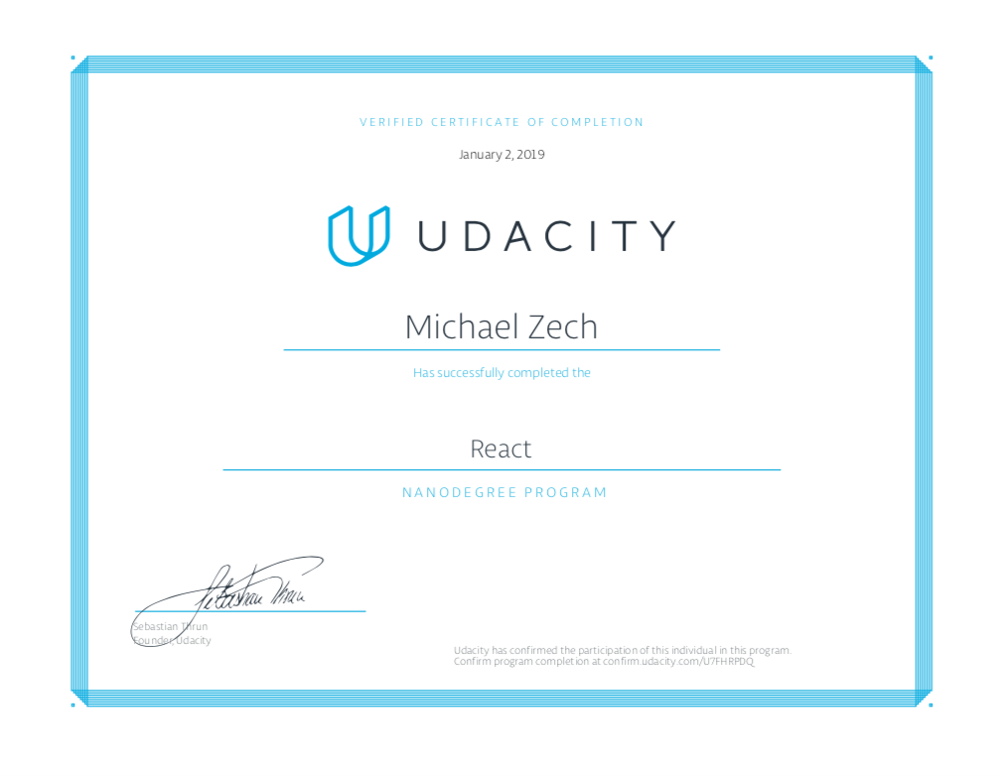

## UDACITY React

### Projects for Udacity's [React Nanodegree](https://eu.udacity.com/course/react-nanodegree--nd019) program

1.  **Introduction**: Book Tracking App

Implement a web application that allows to select and categorize books you have read, you are currently reading and books you want to read.

Used technologies: [React](https://reactjs.org/), [React Router](https://reacttraining.com/react-router/)

2.  **Redux**: Would You Rather?

A web adaption of the "Would You Rather" quiz-game.

Used technologies: [React](https://reactjs.org/), [Redux](https://react-redux.js.org/), [React Router](https://reacttraining.com/react-router/), [Redux-Thunk](https://github.com/reduxjs/redux-thunk)

3.  **React Native**: Mobile Flashcards

A learning app which is based upon flash cards

Used technologies: [React](https://reactjs.org/), [React Native](https://facebook.github.io/react-native/)

